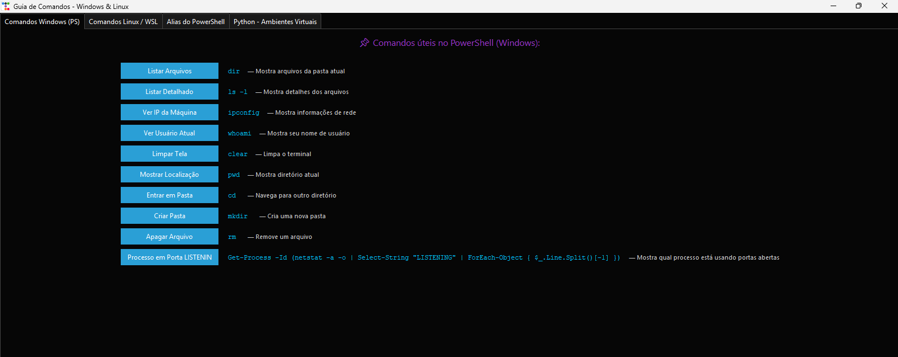
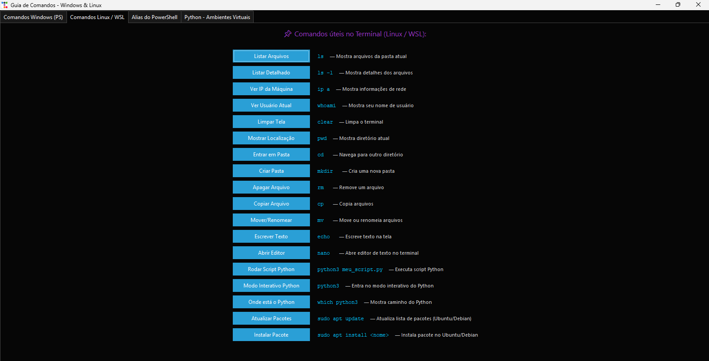
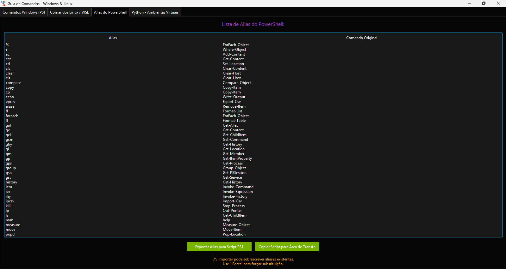
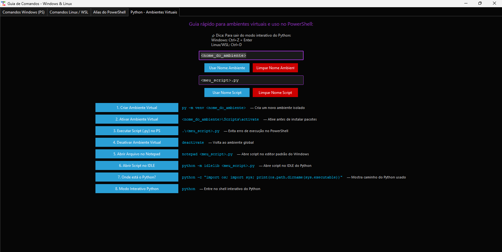

# 📚 Guia de Comandos - Windows & Linux

> Uma ferramenta gráfica simples (e feia, mas prática) para quem vive no terminal.

---

## O que esse programa faz?

Copia os comandos para a área de transferência para não ter que ficar digitando toda hora ⌨️.  
Era para ser um "cheat sheet" rápido com os comandos mais usados no **PowerShell (Windows)** e no **Terminal (Linux/WSL)** mas acabei me empolgando e ficou um pouco a mais hahahaha. 

Tem uma aba com os **alias do PowerShell** e outra pra ajudar com **ambientes virtuais do Python** (muito útil para quem cria vários ambientes virtuais ✋🏾 me)

## 💡 Observação importante

 * Tem alguns comandos Linux que funcionam no PowerShell?  
   Sim 👍🏾, porque alguns terminais já vêm com alias padrão - mas como eu utilizo algumas versões portáteis do terminial, nem sempre vem com o alias, por isso "automatizei" para gerar o alias (eu só clico e importo 🏖️) para outro terminal. Se você rodar `ls` no PowerShell e funcionar... não é magia, é só o alias te salvando, capisci?

<table>
  <tr>
    <td></td>
    <td></td>
    <td></td>
    <td></td>
  </tr>
  <tr>
    <td style="text-align: center;"> Aba 1</td>
    <td style="text-align: center;"> Aba 2</td>
    <td style="text-align: center;"> Aba 3</td>
    <td style="text-align: center;"> Aba 4 </td>
  </tr>
</table> 

#### É tudo feito em Python com `tkinter` e estilizado com `ttkbootstrap`. A interface não é bonita, mas funciona. 
#### Igual aquele TCC que você faz em 2 horas e entrega só para passar mesmo (brincadeira, jamais entreguem um TCC assim 😅). 
---

## 🧩 Abas do Programa

### 1. **Comandos Windows (PS)**  
Lista comandos básicos do PowerShell como `dir`, `ipconfig`, `cd`, `mkdir`, etc. Cada um tem um botão pra copiar pro clipboard.

### 2. **Comandos Linux / WSL**  
Mesma coisa, mas pra quem usa Linux ou WSL. Tem `ls`, `clear`, `python3`, `apt update`, entre outros clássicos.

### 3. **Alias do PowerShell**  
Mostra uma tabela com os alias mais comuns do PowerShell (por exemplo `ls` pra `Get-ChildItem`) e permite exportar um script `.ps1` pra criar todos eles.

### 4. **Python - Ambientes Virtuais**  
Dá dicas de como criar, ativar e usar ambientes virtuais. Você pode digitar o nome do ambiente ou do script e ele atualiza os comandos automaticamente.

---

## ⚙️ Como rodar?

Instale as dependências:

```bash
pip install pyperclip ttkbootstrap
```

No Linux ou WSL, instale isso também:

```bash
sudo apt install xclip
```

Depois é só rodar:

```bash
python main.py
```

---

## 🖥️ Interface?

É feia, sim. Mas é funcional. Se quiser deixar mais bonita depois, dá pra trocar o tema do `ttkbootstrap`.

---

## 📄 Licença

MIT. Use, modifique, compartilhe e me avise se te ajudou.
