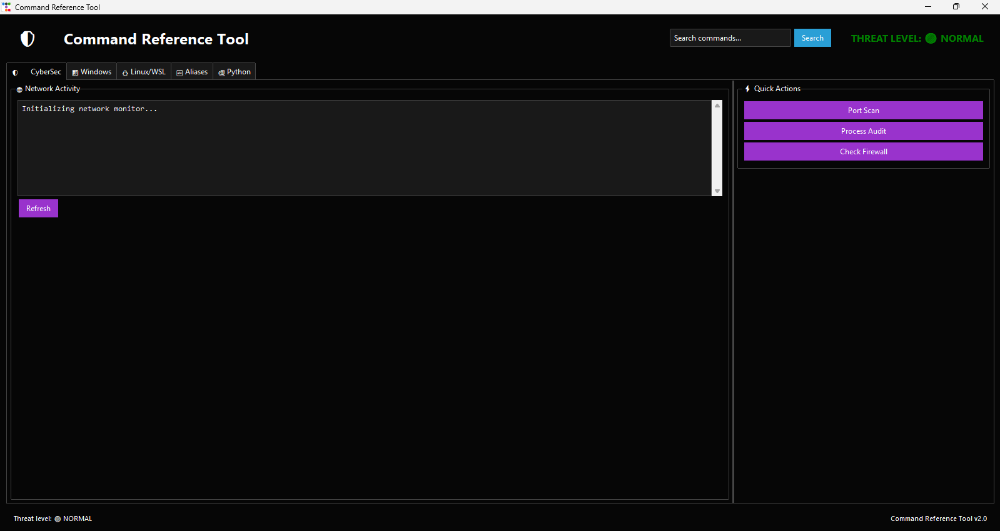
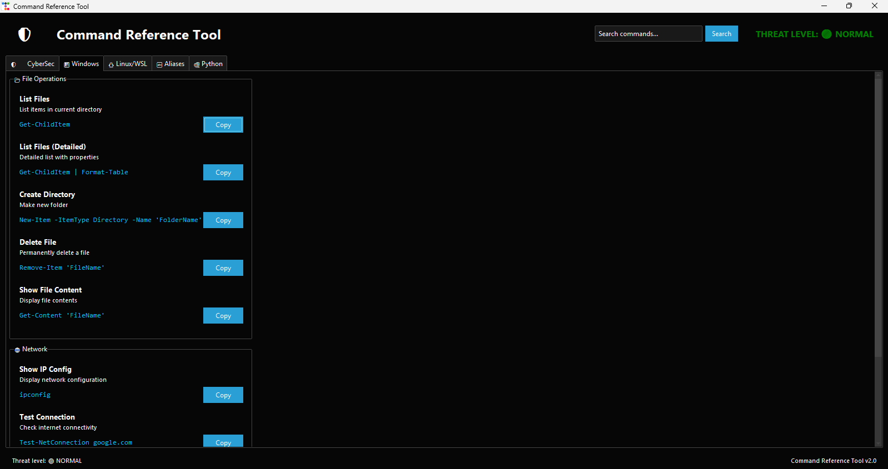

Command Reference Tool v.0
============================

Interface Screenshots
<table>
  <tr>
    <td></td>
    <td></td>
    <td></td>
    <td></td>
  </tr>
  <tr>
    <td style="text-align: center;"> Tab 1</td>
    <td style="text-align: center;"> Tab 2</td>
    <td style="text-align: center;"> Tab 3 NOT INCLUDED IN THIS NEW VERSION</td>
    <td style="text-align: center;"> Tab 4 NOT INCLUDED IN THIS NEW VERSION</td>
  </tr>
</table> 

▌ Features
----------
■ CyberSec Dashboard:
  - Visual threat indicator
  - Security quick checks (Ports/Processes/Firewall)
  - Real-time network monitoring (Get-NetTCPConnection)
> [!WARNING]    
>  NOT for production monitoring (missing critical features like logging/auth)

■ Windows PowerShell:
  - Organized commands (File/Network/System)
  - One-click copy functionality

■ Linux/WSL:
  > [Under Construction]
  > - Essential terminal commands
  > - WSL-specific helpers

■ PowerShell Aliases:
  > [Under Construction]
  > - Full reference table
  > - .ps1 export capability

■ Python Virtual Envs: 
  > [Under Construction]
  > - Quick venv commands
  > - Dependency management

▌ Installation
--------------
1. Install requirements:
   pip install ttkbootstrap pyperclip

2. Run:
   python main.py

▌ Security Notes
---------------
✔ Safe for personal/lab use:
  - Prevents command typos
  - Documents legitimate commands
  - Visualizes network activity

> [!IMPORTANT]   
> ⚠ Enterprise considerations:
 > - No built-in authentication
 > - Limited logging
 > - May trigger SIEM alerts
 > - Recommended for training use only
 > - Security awareness training 

▌ Build Executable
-----------------
pyinstaller --onefile --windowed main.py

▌ Project Structure
------------------
main.py            # Main application
requirements.txt   # Dependencies
Images/            # Screenshots
README.txt         # This file

▌ License
---------
MIT License  

▌ Credits
---------
Developed by **Thiago Maria**  
UI powered by ttkbootstrap  
Code help by Qwen and DeepSeek
